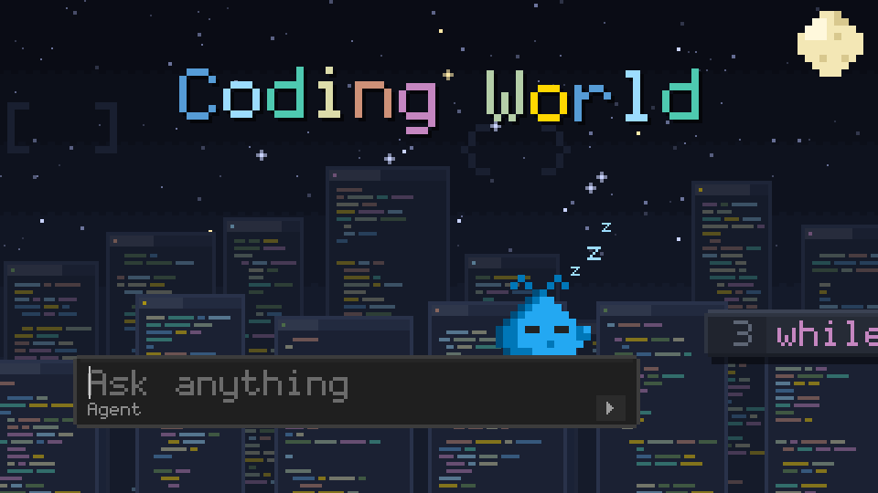
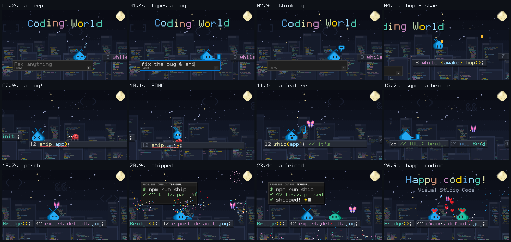
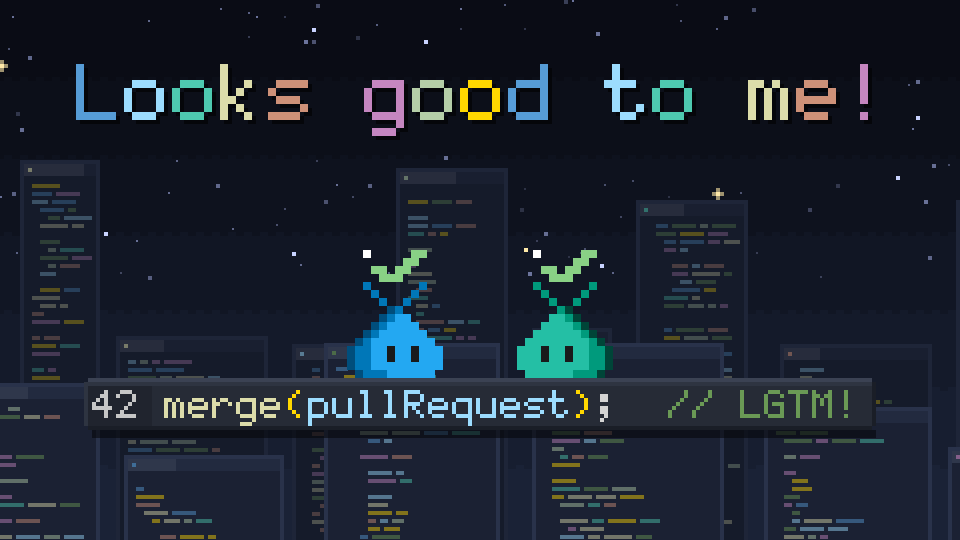
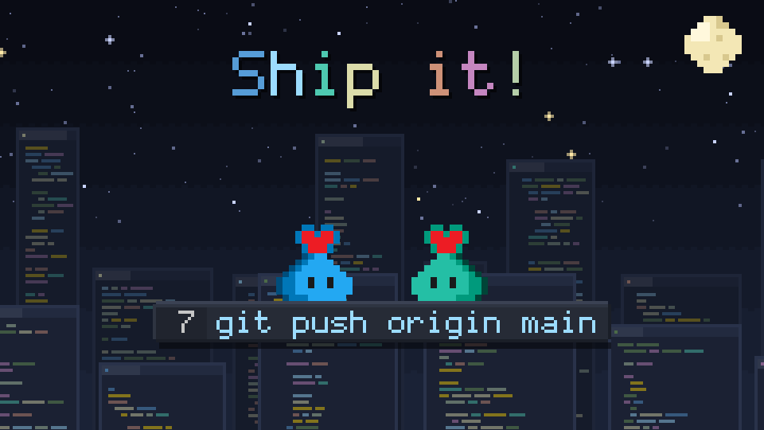
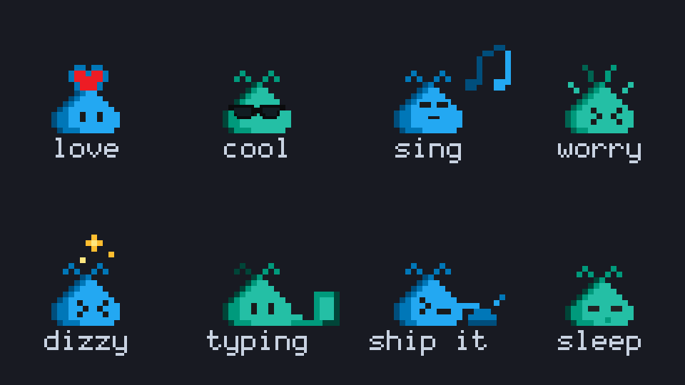
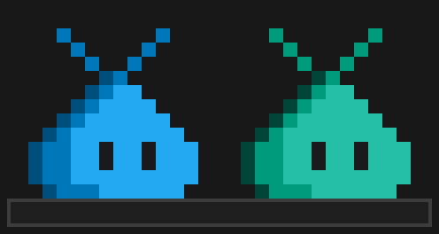
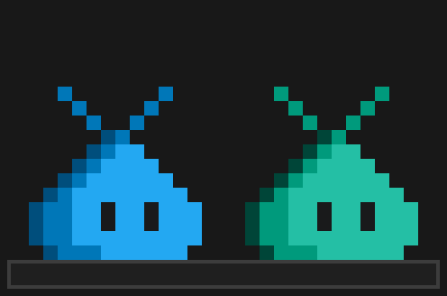
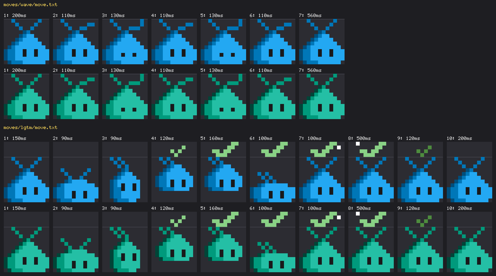
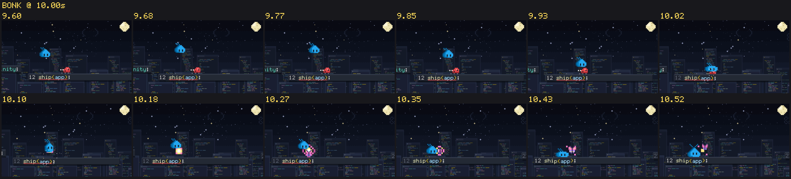
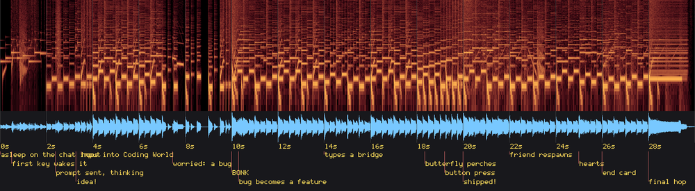

# Pet Studio for Visual Studio Code

Make videos, images and new moves with the **VS Code pet** (the pixel creature above the Visual
Studio Code chat input) by asking an AI agent.



*Coding World: 30 seconds, one shot, made from a one-line brief.
[Download the MP4 with sound](https://github.com/federicobrancasi/pet-studio/releases/tag/v1.0) ·
[how it's built](examples/coding-world/)*

> A personal fan project, not an official Microsoft or Visual Studio Code project. The pet is an
> experimental Visual Studio Code feature. Its artwork belongs to Microsoft (MIT License) and is
> downloaded from [microsoft/vscode](https://github.com/microsoft/vscode) during setup; see
> [NOTICE](NOTICE).

## Quickstart

Python 3.9+ (on Windows, use `py` instead of `python3`):

```sh
git clone https://github.com/federicobrancasi/pet-studio && cd pet-studio
python3 -m pip install -r requirements.txt
python3 -m kit doctor        # checks the setup and downloads the pet sprites
```

Open the folder in Visual Studio Code (Copilot chat, agent mode), GitHub Copilot CLI or Claude
Code, and ask. The `pet-studio` skill loads by itself.

| Ask | You get |
| --- | --- |
| "Make a 20 s video of the pet surfing a git branch, for X" | an MP4 ready to upload, plus a review package |
| "Make a 4K wallpaper of the pet in space" | PNGs for X, square, X header, 4K, phone and sticker |
| "Teach the pet a new move: it juggles curly braces" | sprite sheets for both colorways, a GIF and a preview |
| "Put my juggle move in a short video" | moves work inside videos and images too |

## Examples

**Films.** Every film comes with its beats laid out as a strip:



**Images.** One file renders every preset:

| | | |
| --- | --- | --- |
|  |  |  |
| [`lgtm-poster`](examples/lgtm-poster/still.py): uses a custom move | [`ship-it`](examples/ship-it/still.py): the default layout | [`sticker-pack`](examples/sticker-pack/still.py): real reactions |

**Moves.** A move is a text file, so it can be written in chat and shared anywhere:

| [`wave`](moves/wave/move.txt) | [`lgtm`](moves/lgtm/move.txt) |
| --- | --- |
|  |  |



## How it works

- **Skill** ([`.claude/skills/pet-studio/`](.claude/skills/pet-studio/SKILL.md)). This gives
  the agent the pet's rules (the real sprites only, whole pixels, blue Stable and green
  Insiders, no invented name) and a workflow: brief, beats, key frame first, build, review,
  sign-off.
- **Kit** (`kit/`, plain Python: Pillow, numpy and ffmpeg).
  - A film is one file: `render(t)` returns the frame at time `t`, and `score(mix)` writes the
    music.
  - Every frame is a pure function of time, so any moment can be re-rendered exactly.
- **Review.** `python3 -m kit film review` renders the MP4 and writes the files a reviewer needs:
  - contact sheets
  - a frame and a motion strip for every beat
  - an audio spectrogram
  - loudness and X upload checks

  The `pet-director` agent reads these and returns `VERDICT: SIGNED OFF` or a list of fixes.





## Teach the pet a new move

Each frame is a 12 x 12 grid, one letter per pet pixel:

- `C`, `A` and `B` are the body's light, mid and dark colors, so one grid makes both colorways.
- `E` is an eye.
- `.` is transparent.
- Props get their own letters.

```text
name: wave
about: Waves hello with its right antenna.
loop: yes

frame 110
..A.........
...A.....AA.
....A..AA...
.....BA.....
....BACC....
...BACCCC...
..BACCCCCC..
.BACCCCCCCC.
BAACCECCECCC
BAACCECCECCC
BAACCCCCCCCC
.BAAACCCCCC.
```

```sh
python3 -m kit move new juggle --frames 6 --height 16   # every frame starts as the real pet
python3 -m kit move build juggle                        # validates, then writes sprites and previews
```

Visual Studio Code only plays the pet animations it ships with, so a new move doesn't appear in
the editor. Its `vscode/` folder uses the same sprite format as the pet, so it's easy to try in a
local build. New moves for the [gallery](moves/README.md) are welcome.

## Commands

Run these from the repo root; `python3 -m kit --help` lists everything. Films and stills can be
given by name or by path, and output goes to `out/`, which git ignores.

```sh
python3 -m kit poses --list                  # every real pet state, with frames and timing
python3 -m kit film new my-film              # also: sheet, frame --at 3.2, render --draft, review, gif
python3 -m kit still new my-poster           # then: still render my-poster --all
python3 -m kit move new my-move              # also: grid jump:3, build, gallery
```

Run the tests with `python3 -m unittest discover -s tests -v`. The sprites are pinned to a
microsoft/vscode commit (`kit/sprites.json`); `python3 -m kit doctor --update` moves the pin.

## License

The code, docs and original music are MIT ([LICENSE](LICENSE)). The pet artwork belongs to
Microsoft and is used under the microsoft/vscode MIT License. The sprite files aren't stored
here, but the previews, sprite sheets, move grids and media are derived from them;
[NOTICE](NOTICE) has the details. Inspired by
[sevenevesai/riso-windowseat](https://github.com/sevenevesai/riso-windowseat).
