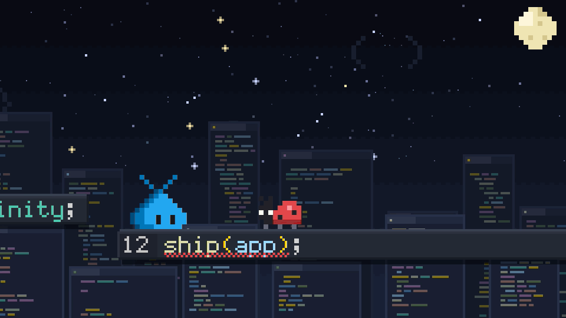
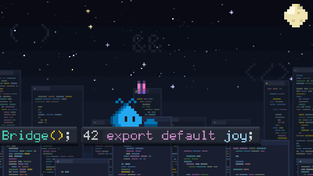

# Pet Studio for Visual Studio Code

Make videos, images and brand-new moves with the **VS Code pet**, the little pixel creature
that sits above the chat input in Visual Studio Code, just by asking an AI agent in chat.



This repo holds everything used to make **Coding World**, a 30-second one-shot film that Claude
Opus 5.5 built and signed off for posting on X, turned into a kit anyone can use:

- **a skill** that teaches the agent the pet's rules and the workflow (`.claude/skills/pet-studio/`)
- **the tools** that load the real pet sprites, draw, compose music, export for X and build
  review packages (`kit/`)
- **examples** to learn from, and a **gallery of new moves** people taught the pet (`moves/`)

> A personal fan project, not an official Microsoft or Visual Studio Code project. The pet is an
> experimental Visual Studio Code feature; its artwork belongs to Microsoft (MIT License) and is
> downloaded from [microsoft/vscode](https://github.com/microsoft/vscode) when you set up. See
> [NOTICE](NOTICE).

## Quickstart

You need Python 3.9 or newer. Everything else, including ffmpeg, comes from `pip`.

```sh
git clone https://github.com/federicobrancasi/pet-studio
cd pet-studio
python3 -m pip install -r requirements.txt
python3 -m kit doctor        # checks the setup and downloads the pet sprites
```

On Windows, use `py` instead of `python3`. Then open the folder in **VS Code** (Copilot chat
in agent mode), **GitHub Copilot CLI** or **Claude Code**, and ask. The `pet-studio` skill
loads automatically.

| Ask for | You get |
| --- | --- |
| "Make a 20 second video of the pet surfing a git branch, for X" | `out/<name>/<name>.mp4`, 1080p60, ready to upload, with a review package and a sign-off |
| "Make a 4K wallpaper of the pet in space" | PNGs for every preset: X post, square, X header, 4K wallpaper, phone, sticker |
| "Teach the pet a new move: it juggles curly braces" | Stable (blue) and Insiders (green) sprite sheets in VS Code's own format, a GIF and a preview |
| "Put my juggle move in a short video" | moves work inside videos and images too |

## How it works

1. **The skill** (`.claude/skills/pet-studio/SKILL.md`) tells the agent the pet's rules (no
   invented name, whole pixels only, blue Stable and green Insiders, 1x2 eyes, brand-safe
   output) and the workflow: brief, beats, hard frame first, build, review, sign-off. Guides
   cover [video](.claude/skills/pet-studio/guides/video.md),
   [images](.claude/skills/pet-studio/guides/image.md),
   [moves](.claude/skills/pet-studio/guides/move.md),
   [sound](.claude/skills/pet-studio/guides/sound.md) and
   [sign-off](.claude/skills/pet-studio/guides/sign-off.md).
2. **The kit** is plain Python (Pillow, numpy and ffmpeg). The pet is always the **real**
   sprites from Visual Studio Code, played with its own frame timings. A film is one file with
   `render(t)`, a pure function of time, so any frame can be re-rendered exactly, plus an
   optional `score(mix)` for the music.
3. **Review and sign-off.** `python3 -m kit film review` renders the MP4 and writes contact
   sheets, a frame and a motion strip for every story beat, an audio spectrogram, loudness and
   X upload checks. The `pet-director` agent (`.claude/agents/`) reads that package and returns
   `VERDICT: SIGNED OFF` or a list of must-fixes. That is how Coding World was approved.

## Teach the pet a new move

A move is a text file: each frame is a grid with one letter per pet pixel, so a move can be
written in chat, pasted into Slack, or reviewed in a pull request.

```text
name: wave
about: Waves hello with its right antenna.
loop: yes

frame 110
..A.........
...A.....AA.
....A..AA...
.....BA.....
....BACC....
...BACCCC...
..BACCCCCC..
.BACCCCCCCC.
BAACCECCECCC
BAACCECCECCC
BAACCCCCCCCC
.BAAACCCCCC.
```

`C`, `A` and `B` are the body's light, mid and dark colors, so one grid produces both the blue
and the green pet. `E` is an eye, `.` is transparent, and props get their own letters. Ask the
agent, or do it by hand:

```sh
python3 -m kit move new juggle --frames 6 --height 16   # starts every frame from the real pet
python3 -m kit move build juggle                        # validates, then writes sprites + previews
```

| Move | Preview |
| --- | --- |
| [`wave`](moves/wave/move.txt): waves hello with its right antenna |  |
| [`lgtm`](moves/lgtm/move.txt): approves your pull request |  |

More in the [moves gallery](moves/README.md). Pull requests with new moves are welcome here.

**Can I see my move inside VS Code?** Not directly: Visual Studio Code only plays the
animations that ship with it, and the pet itself is experimental. Each move's `vscode/` folder
has the move as sprite sheets, reduced-motion stills and frame timings in the same format as
the pet's own sprites, so it's easy to try in a local build of Visual Studio Code.

## Examples

| | |
| --- | --- |
| [`examples/coding-world/`](examples/coding-world/) | The signed-off 30 s film: bug fix, code bridge, shipping, a friend and hearts. [Watch the MP4](https://github.com/federicobrancasi/pet-studio/releases/tag/v1.0) |
| [`examples/lgtm-poster/`](examples/lgtm-poster/) | An image that uses the custom `lgtm` move, in every preset |



## Commands

All commands run from the repository root. `python3 -m kit --help` lists everything.

```sh
python3 -m kit doctor                          # check setup, download sprites
python3 -m kit poses --list                    # every real state, frame count and timing
python3 -m kit poses                           # a contact sheet of every pose

python3 -m kit film new my-film                # start a film from the template
python3 -m kit film sheet my-film              # a frame every 0.5 s
python3 -m kit film frame my-film --at 3.2
python3 -m kit film render my-film --draft
python3 -m kit film review my-film             # final MP4 + review package
python3 -m kit film gif my-film --from 3 --to 6

python3 -m kit still new my-poster
python3 -m kit still render my-poster --all

python3 -m kit move new my-move
python3 -m kit move grid jump:3                # print any real pose as a grid
python3 -m kit move build my-move
python3 -m kit move gallery                    # add built moves to moves/README.md
```

Films and stills can be given by name (from `films/`, `stills/` or `examples/`) or by path.
Outputs go to `out/`, which git ignores. Run the tests with
`python3 -m unittest discover -s tests -v`.

## Reproducible

- The sprites are pinned to one microsoft/vscode commit in `kit/sprites.json` and checked
  against SHA-256 checksums. `python3 -m kit doctor --update` moves the pin to the latest pet.
  Set `PET_STUDIO_VSCODE_ROOT` to use a local Visual Studio Code checkout instead.
- Frames and audio are deterministic: `examples/coding-world` renders exactly the frames and
  soundtrack of the published film (with the same ffmpeg build, even the MP4 is byte-identical).

## Credits

- The VS Code pet: created by the Visual Studio Code team at Microsoft.
- Coding World and this kit: directed by Federico Brancasi, built by Claude Opus 5.5 using
  GitHub Copilot in Visual Studio Code.
- Inspired by [sevenevesai/riso-windowseat](https://github.com/sevenevesai/riso-windowseat),
  which shared its films together with the skills and tools used to make them.

## License

The code, docs and original music here are MIT; see [LICENSE](LICENSE). The pet artwork is
Microsoft's, under the MIT License of microsoft/vscode. The original sprite files are not stored
here, but the previews, sprite sheets, move grids and media in this repo are derived from them;
[NOTICE](NOTICE) has the details and Microsoft's license text.
