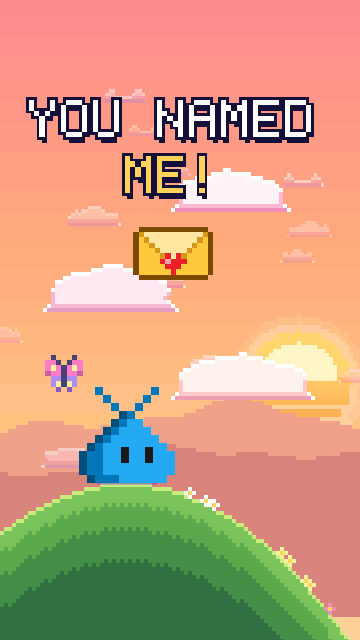

# Blobby: the name reveal

A 15-second vertical (9:16) reel for Reels, TikTok, Shorts and X. The community picked a name for
the VS Code pet, and this is how the pet finds out: a golden envelope with the winning name
drifts down to it, a gust steals it, and the pet chases it up a sunset sky from cloud to cloud
until a spring cloud launches it high enough to catch it. BLOBBY bursts out, the pet hops along
its new name one note per letter, and then it speaks its first words with it: "HI, I'M BLOBBY!",
"THANK YOU FOR MY NAME!" and "HAPPY CODING!"

- **Watch:** the MP4 (with sound) is on the [v1.5.2 release](https://github.com/federicobrancasi/pet-studio/releases/tag/v1.5.2).
- **Rebuild:** `python3 -m kit film review blobby` (the MP4 and its review package, with
  `safe-zones.png`).
- **The words** are at the top of `film.py`. The reveal celebrates the real naming contest, so
  make your own films about something else.

| Time | Beat | States and moves |
| --- | --- | --- |
| 0-1 s | The hook: "YOU NAMED ME!" as the envelope drifts down, and an excited hop | `jump` |
| 1 s | A gust snatches the envelope and blows the caption away | |
| 1.5-2.95 s | The chase: a hop to a cloud, a lunge... and the envelope zips away | `jump`, `falling` |
| 2.95 s | A jelly splat on the next cloud, and the pet bounces back | `splat` |
| 3.6-4.2 s | A spring cloud squashes under it and fires it up into dusk | `jump` |
| 5.25 s | It catches the envelope and dangles from it | `falling` |
| 6 s | Flash: the envelope bursts and BLOBBY flies out, letter by letter | |
| 6.5-9.6 s | It hops along its name on the beat, one note per letter, then a big joy jump | `jump` |
| 9.9 s | Standing on its name: "HI, I'M BLOBBY!", then a wave | `rendering`, `wave` |
| 12 s | Close-up: "THANK YOU FOR MY NAME!", and its antennae curl into a heart | `rendering`, `love` |
| 14-15 s | The end card pulls back to the name: "HAPPY CODING!", and a goodbye wave | `rendering`, `wave` |

Routines worth reusing from `film.py`, `blobby_world.py` and `blobby_props.py`:

| Technique | Where |
| --- | --- |
| A chase up a world taller than the screen, with a camera that follows the pet | `camera_target`, `CAMERA`, `render_chase` |
| Cloud platforms that dip under a landing, and a spring cloud that squashes and fires | `BW.Platform`, `BW.dip`, `spring_rows` |
| A prop on its own path that keeps getting away, and eyes that follow it | `envelope_pos`, `gaze_at` |
| A flash that bursts into bubble letters, each squashing when the pet lands on it | `BP.flash`, `BP.Logo`, `letter_state` |
| One note per letter, on the beat | `LETTER_LANDS`, `LETTER_NOTES` |
| A pet that talks without a mouth: its `rendering` state, squashing on every syllable, with one note per syllable | `talk_pose`, `babble` |
| Speech bubbles that pop in and type in, on one line or several | `BP.speech_bubble`, `bubble_rise` |
| A built-in reaction played a little faster, so it finishes before a cut | `wide_pose` (`LOVE_SPEED`) |
| A 2x close-up cropped from the same frame (effects drawn before the zoom keep the pet's pixel size), then an end card that pulls back | `render_closeup`, `render` |

This film came before `kit.sky` and `kit.letters`, which grew out of its helpers. For a new
film, start from those (`sky.CloudPlatform`, `sky.rays`, `letters.BubbleWord`, `draw.zoom`).
