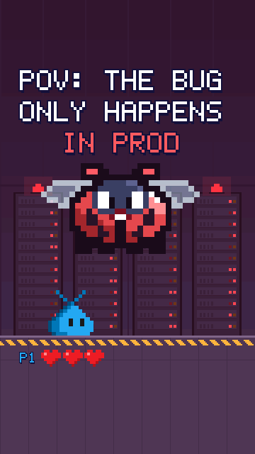

# Boss fight

A 20-second vertical (9:16) reel for Reels, TikTok, Shorts and X: "POV: the bug only happens in
prod", told as a retro video-game boss fight in a server room. The VS Code pet dodges the bug's
error rain, gets zapped by "WORKS ON MY MACHINE!", finds the weak spot with a rubber duck, and
teams up with the Insiders pet for a double stomp. The bug turns into a butterfly: it's not a
bug, it's a feature.

- **Watch:** the MP4 (with sound) is on the [v1.5.1 release](https://github.com/federicobrancasi/pet-studio/releases/tag/v1.5.1).
- **Rebuild:** `python3 -m kit film review boss-fight` (the MP4 and its review package, with
  `safe-zones.png`).

| Time | Beat | Moves and states |
| --- | --- | --- |
| 0-1.8 s | The hook: "POV: the bug only happens in prod"; the pet hops back from the boss | `jump`, `worry` |
| 1.8 s | FIGHT! The boss bar slides in | |
| 3-4 s | Three error blocks fall on the beat: MISS! MISS! MISS! | `jump` (dodges) |
| 4.3 s | PROD BUG USED WORKS ON MY MACHINE!: lightning, IT'S SUPER EFFECTIVE!, a heart lost | `zapped` |
| 7.15 s | An item box drops: ITEM GET: RUBBER DUCK! Its squeak finds the WEAK SPOT | `rubber-duck` |
| 10 s | PLAYER 2 HAS JOINED!: the Insiders pet arrives through a portal | `fx.respawn` |
| 12 s | A double stomp on the weak spot: CRITICAL HIT! -9999 | `jump` |
| 13 s | The bug shrinks into a butterfly: IT'S NOT A BUG... IT'S A FEATURE | |
| 15.5 s | BUG FIXED! +1000 XP: victory hops and claps, the alarms turn green | `jump`, `clapping` |
| 17-20.5 s | "What's your final boss bug?": the butterfly lands on the pet | |

Routines worth reusing from `film.py` and `arena.py`:

| Technique | Where |
| --- | --- |
| A big character drawn from shapes on the pet's grid, outlined and shaded like the pet | `arena.boss_grid`, `boss_sprite` |
| Whole-pixel squash, glow and shrink (cells of 24, 20, 16... px) | `boss_look`, `draw_boss` |
| Pets standing on a moving character: its surface under each foot | `surface` |
| A game HUD: a health bar with a trailing ghost, hearts, floating damage numbers | `arena.boss_bar`, `hearts`, `pop`, `hud` |
| Banners that slide in on the beat and stay up long enough to read | `BANNERS`, `banners` |
| Ready-made moves as story beats (`zapped`, `rubber-duck`) and two pets playing together | `p1_pose`, `p2_pose` |
| Screen shake and partial flashes on the hits, never a strobe | `shake`, `fx.flash(..., strength=0.4)` |
| A comment-bait end card | `hud` (from `T_END`) |
