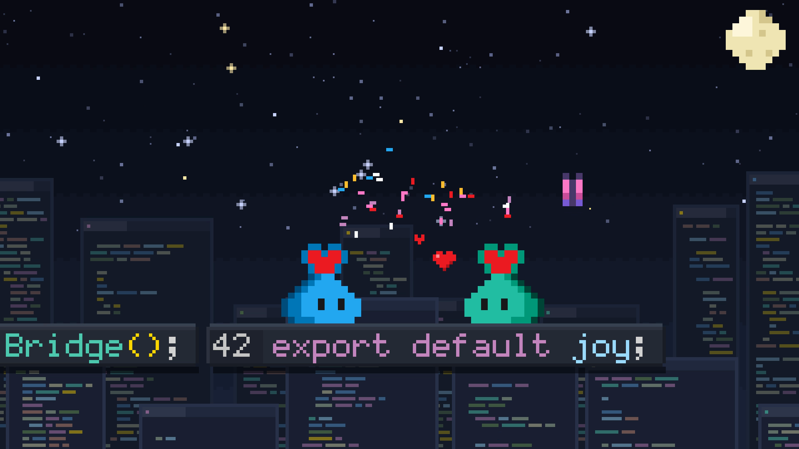

# Coding World

A 30-second one-shot film. The VS Code pet fixes a bug, builds a bridge out of code, ships the
app, and celebrates with a friend.

- **Watch:** the MP4 (with sound) is on the [v1.0 release](https://github.com/federicobrancasi/pet-studio/releases/tag/v1.0).
- **Rebuild:** `python3 -m kit film render coding-world` (about two minutes).

| Time | Beat |
| --- | --- |
| 0-3.5 s | The pet sleeps on the chat input, wakes when a prompt is typed, types along, then thinks |
| 3.5-10 s | It hops across lines of code collecting stars, spots a bug and bonks it |
| 10-18 s | The bug turns into a butterfly (`// it's a feature!`), and the pet types a bridge over a gap |
| 18-24 s | A button-press celebration: tests pass, the app ships, and a friend drops in |
| 24-30 s | Hearts, the end card, and a final hop together |

Routines worth reusing from `film.py`:

| Technique | Where |
| --- | --- |
| A follow camera that holds still for key moments | `camera_target`, `FollowCamera` |
| Pet states over time, with hops, blinks and gaze | `hero_pose`, `HOPS` |
| Typing into the chat input; code that types itself | `world.chat_input`, `CodeLine` characters with `appear` times |
| A gag: squash, poof, transformation | `draw_bug`, `fx.poof`, `draw_butterfly` |
| A second pet arriving (portal, fall, splat) | `friend_pose`, `fx.respawn` |
| Music sections and sound effects on the picture's timeline | `music`, `sound_effects` |

This film's end card carries a small "Visual Studio Code" line. New work should leave product
names and logos off (see the brand rules in the skill's style guide).
