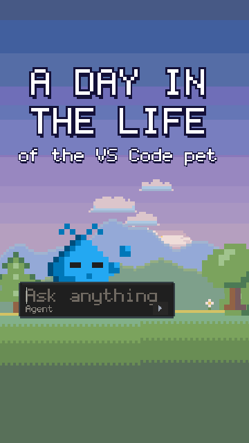

# A day in the life

A 35-second vertical (9:16) reel for Reels, TikTok, Shorts and X. The VS Code pet travels through
its coding day: it wakes up at sunrise on its chat input, has its coffee and an idea, talks it
through with a rubber duck, builds a rocket, squashes a bug, survives a merge conflict, finally
merges, ships the rocket, logs off and comes home at night to sleep. It hops from stop to stop
across a meadow, a golden field and a desert at sunset, and every stop is one of the ready-made
moves in [`moves/`](../../moves/README.md).

- **Watch:** the MP4 (with sound) is on the [v1.4 release](https://github.com/federicobrancasi/pet-studio/releases/tag/v1.4).
- **Rebuild:** `python3 -m kit film review pet-day` (the MP4 and its review package, with
  `safe-zones.png`).

| Time | Beat | Move |
| --- | --- | --- |
| 0-2 s | The hook: "a day in the life of the VS Code pet", as the sun comes up | `waking` |
| 2 s | 09:00 coffee first, on the chat input | `coffee` |
| 6 s | 09:30 a wild idea, under a tree | `idea` |
| 9 s | 10:00 rubber ducking, by a pond | `rubber-duck` |
| 12.75 s | 11:00 building it: a rocket, piece by piece | `build` |
| 16 s | 13:00 oh no, a bug! | `debug` |
| 19.75 s | 14:00 merge conflict: a storm dims the world | `zapped` |
| 23 s | 15:00 finally merged! | `lgtm` |
| 26 s | 16:00 ship it! The rocket it built blasts off | `ship-it` |
| 28.25 s | 18:00 logging off, by a ranch fence at sunset | `cowboy` |
| 30.5-35.3 s | 21:00 home sweet home, then "Happy coding!" while the pet dozes off on its chat input | `waking` backwards, then `sleep` |

Between stops the pet hops (one big hop or two small ones), and the camera follows it.

Routines worth reusing from `film.py`:

| Technique | Where |
| --- | --- |
| A journey from ready-made moves: change `DAY` and the stops, hops, clock and music follow | `DAY`, `_schedule` |
| A camera that follows the pet sideways and keeps it on the left third | `camera_target`, `PET_SCREEN_X` |
| A sky that follows the clock, and a world lit by it (the pet keeps its colors) | `hour_at`, `light_at`, `sky.day_keys`, `sky.day_light` |
| A landscape: far hills, a ground that turns from meadow to sand, and props | `FAR`, `NEAR`, `GROUND`, `SCENERY` |
| A storm that greys the sky and dims the world for one gag | `storm`, `sky_keys`, `light_at`, `STORM_CLOUDS` |
| A prop that outlives its move: the rocket flies on off the top of the frame | `rocket_off` |
| Outlined captions, readable on a bright sky, inside the vertical safe area | `caption`, `world.caption` |
| Sound effects on a move's own frames | `at(name, frame)`, `sound_effects` |
| Reviewing each stop at its move's key frame | `CUES` |
