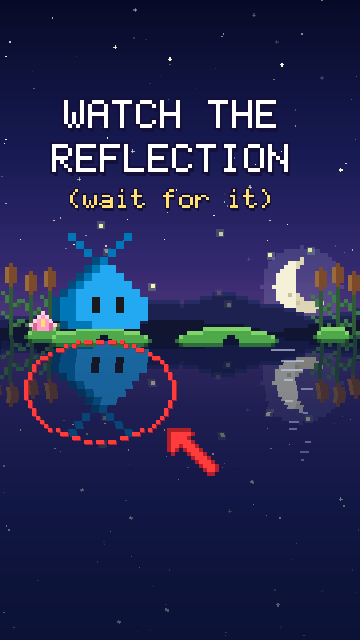

# Watch the reflection

A 17-second vertical (9:16) reel for Reels, TikTok, Shorts and X, built on "wait for it". At a
night pond, the Stable (blue) pet sits on a lily pad, and its reflection copies it perfectly...
until it doesn't: the reflection waves first, then hops before the pet does. It glitches green,
leaps out of the water and lands on the next lily pad: it's the Insiders pet, in sunglasses. "I'M
FROM INSIDERS! I GET EVERY UPDATE FIRST." The end card asks: which team are you?

- **Watch:** the MP4 (with sound) is on the [v1.5.2 release](https://github.com/federicobrancasi/pet-studio/releases/tag/v1.5.2).
- **Rebuild:** `python3 -m kit film review reflection` (the MP4 and its review package, with
  `safe-zones.png`).

| Time | Beat | States and moves |
| --- | --- | --- |
| 0-2 s | The hook: "WATCH THE REFLECTION (wait for it)", with a circle and an arrow on the reflection. It blinks on its own once, for anyone who watches again | |
| 1.8 s | The reflection waves first: "IT WAVED FIRST?!" | `wave` |
| 2.5-3.4 s | The pet notices ("?") and waves, late; the reflection just watches | `wave` |
| 4.9 s | The reflection hops early: "AND AGAIN?!" | `jump` |
| 5.75 s | The pet hops, and the reflection doesn't: "IT'S... EARLY?!" | `jump` |
| 6.4 s | The pet leans in; the reflection stops copying and stares out at you | |
| 7 s | It glitches green: "WHO ARE YOU?!" | |
| 7.5-8 s | Splash: the Insiders pet leaps out and lands on the next lily pad | `worry`, `jump` |
| 8.3 s | Sunglasses on | `cool` |
| 9.5-13.5 s | "I'M FROM INSIDERS!", "I GET EVERY UPDATE FIRST" | `speechless` |
| 13.5-17 s | The end card: "WHICH TEAM ARE YOU?", a STABLE and an INSIDERS tag, "COMMENT BELOW!" | `wave`, `jump` |

Routines worth reusing from `film.py` and `pond.py`:

| Technique | Where |
| --- | --- |
| Water that mirrors one layer of everything above it: flipped, rippled and tinted | `pond.above`, `pond.reflect` |
| A reflection with its own timeline that drifts out of sync with the pet | `reflection_pose` |
| A glitch: the sprite sliced into bands that jump sideways, plus noise | `draw_glitched` |
| A character climbing out through the surface, cut at the waterline | `draw_insiders` |
| Lily pads that dip under a landing, ripple rings and a splash | `pad_dip`, `pond.ripple_ring`, `pond.splash` |
| A thumbnail-style circle and arrow for the hook | `pond.red_ring` |
| Two pets as two teams, with tags and an end card that asks for comments | `team_tag`, `end_labels` |
