# Moves gallery

Moves for the VS Code pet, ready to use in films and images. Each folder has the move as text
(`move.txt`), previews and `vscode/` sprite sheets in the exact format VS Code uses. To add
yours, see the main [README](../README.md#teach-the-pet-a-new-move).

| Move | What it does | Preview |
| --- | --- | --- |
| [`angry`](angry/move.txt) | The pet flies into a rage: it shakes, turns deep red, steam blasts from its antennae and GRR! flashes, then it slowly cools down. | 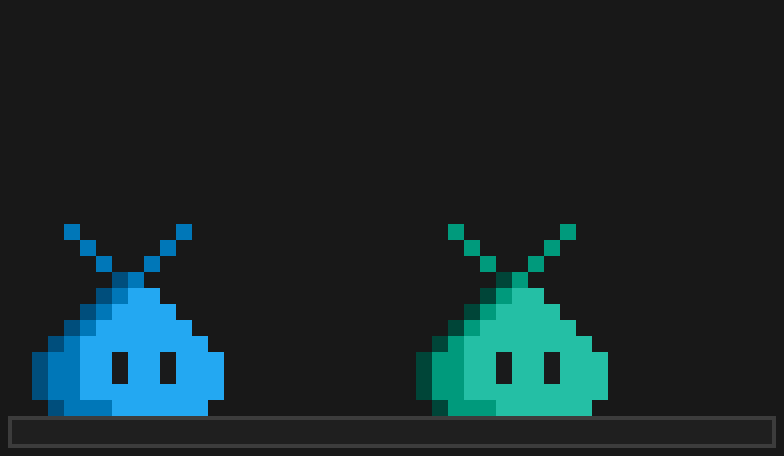 |
| [`build`](build/move.txt) | Builds a little rocket: the fins, the body and the nose cone drop into place one by one, its window lights up, and the pet hops for joy. | 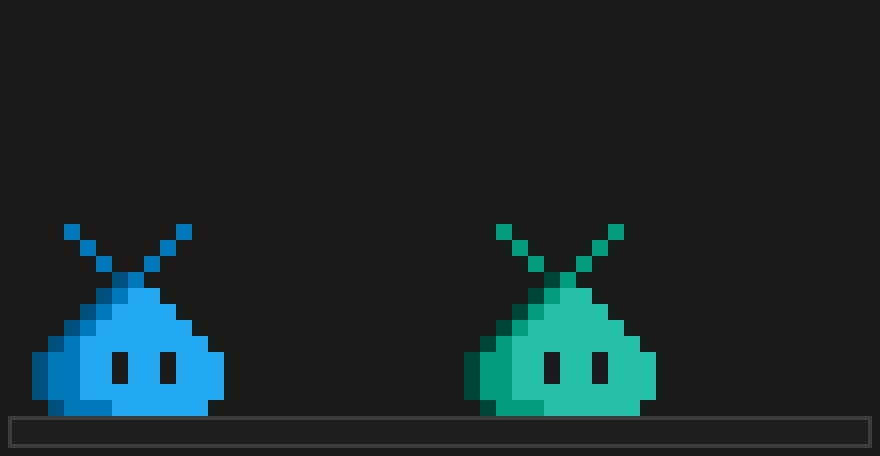 |
| [`coffee`](coffee/move.txt) | A steaming mug of coffee appears in front of it; the pet breathes in the aroma and closes its eyes, blissful. | 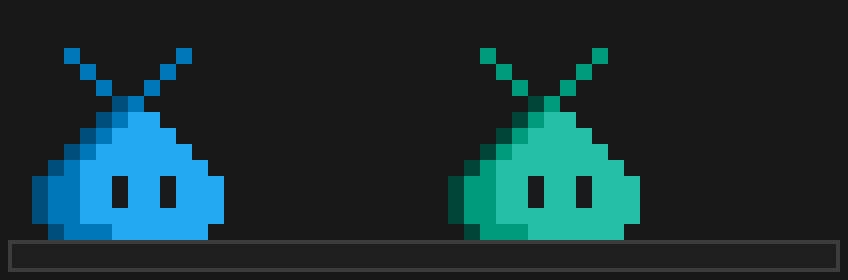 |
| [`cowboy`](cowboy/move.txt) | Puts on a cowboy hat, twirls a lasso over its head with one antenna, throws it, and tips its hat. | 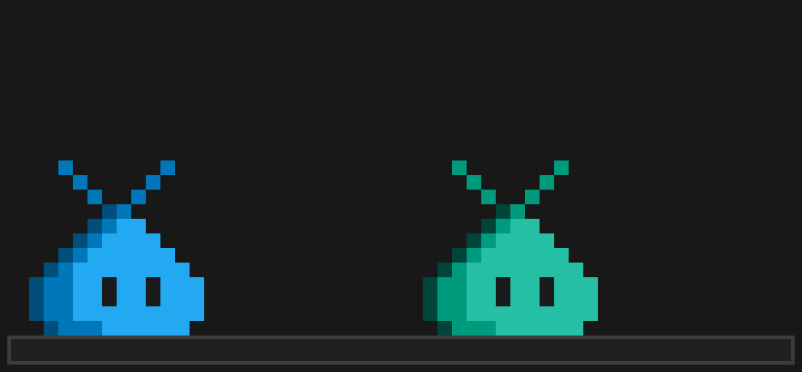 |
| [`debug`](debug/move.txt) | A bug crawls up; the pet raises a big hammer with its antenna and smashes it flat, right on top. Bug fixed! | 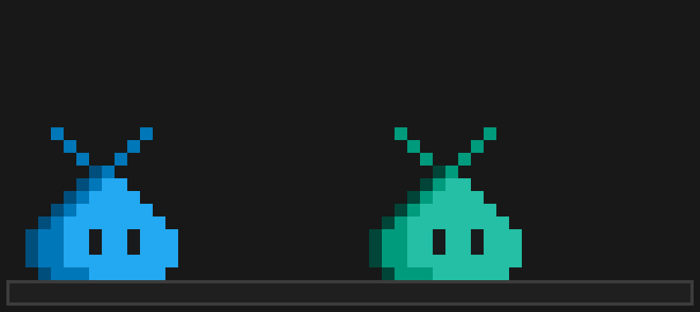 |
| [`idea`](idea/move.txt) | Looks up as a light bulb appears above its head, flickers on, and shines. | 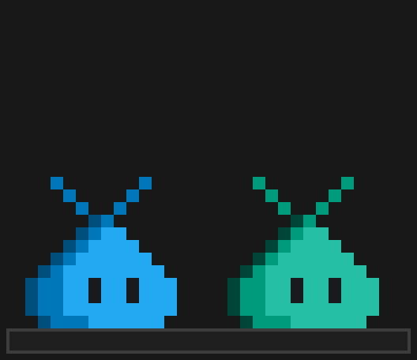 |
| [`lgtm`](lgtm/move.txt) | Approves your pull request with a hop and a green check. | 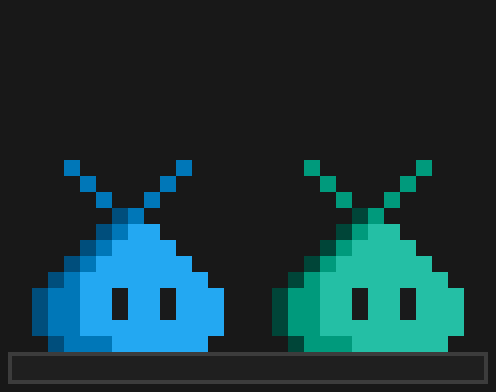 |
| [`magic`](magic/move.txt) | Raises a magic wand with its antenna, swishes it, and a shower of colorful stars bursts out. | 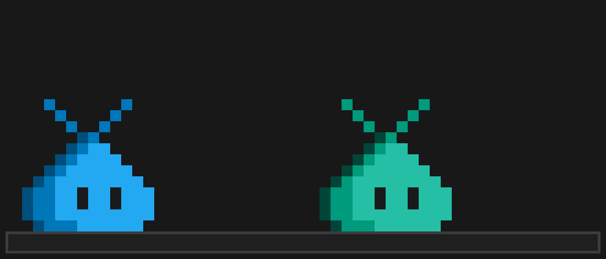 |
| [`rubber-duck`](rubber-duck/move.txt) | A rubber duck plops down in front of it; the pet presses it, it squeaks, and the pet jumps in surprise. | 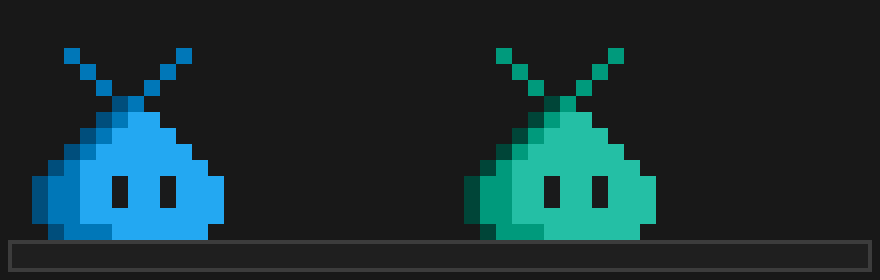 |
| [`ship-it`](ship-it/move.txt) | A little rocket fires up in front of it and blasts off; the pet follows it with its eyes and cheers. |  |
| [`trophy`](trophy/move.txt) | A gold trophy rises beside it, a shine sweeps across it, and the pet cheers with sparkles. | 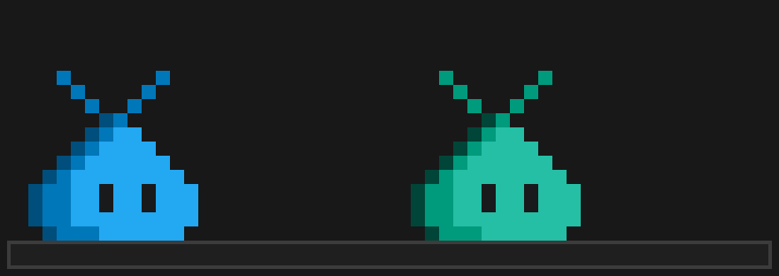 |
| [`wave`](wave/move.txt) | Waves hello with its right antenna. | 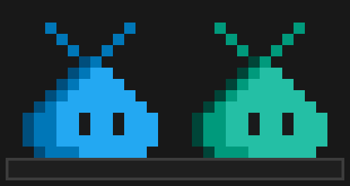 |
| [`yes`](yes/move.txt) | Crouches, jumps for joy, and a big gold YES! pops up above its head. | 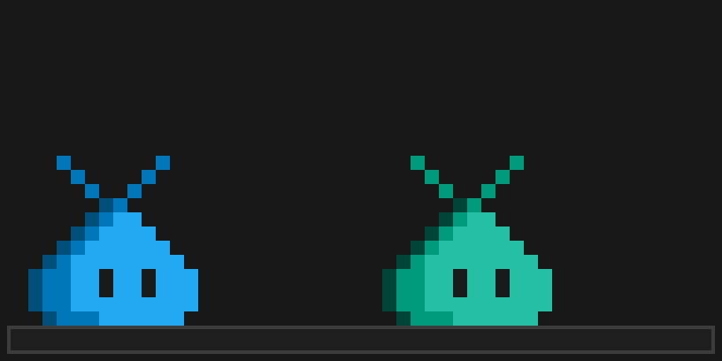 |
| [`zapped`](zapped/move.txt) | A storm cloud rains on it, lightning strikes, it flashes electrified with X eyes, and ends up charred and smoking. | 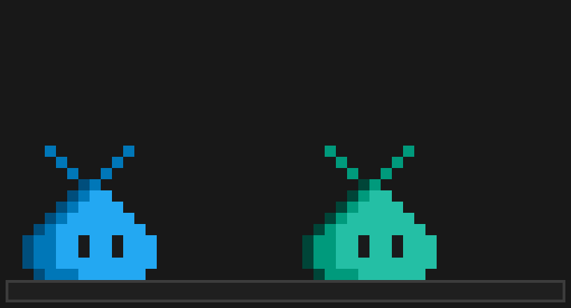 |
